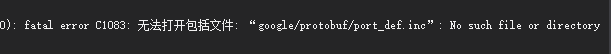
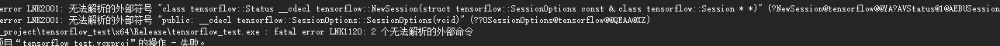

> 参考Tensorflow官网安装文章：https://www.tensorflow.org/install/source_windows?hl=zh-cn

### 一. 下载需要的软件

* bazel：Google 的一款可再生的代码构建工具，类似于Cmake。使用scoop进行安装：`scoop install bazel`
* python3.7：这里最好用pip 安装下必要的第三方包，比如`tensorflow,kears,numpy`等。
* 下载官方源码：`git clone https://github.com/tensorflow/tensorflow.git`

### 二. 进行bazel源码编译

#### 2.1 配置build

* cd到源码目录：`cd tensorflow-master`
* 通过在 TensorFlow 源代码树的根目录下运行以下命令来配置系统构建：`python3 ./configure.py`
* 这里选择的是cpu版本的，每个配置的选择如下：

```bash
You have bazel 3.7.0 installed.
Please specify the location of python. [Default is C:\soft\python3.7.9\python3.exe]:


Found possible Python library paths:
  C:\soft\python3.7.9\lib\site-packages
Please input the desired Python library path to use.  Default is [C:\soft\python3.7.9\lib\site-packages]

Do you wish to build TensorFlow with ROCm support? [y/N]: n

Do you wish to build TensorFlow with CUDA support? [y/N]: n
No CUDA support will be enabled for TensorFlow.

Please specify optimization flags to use during compilation when bazel option "--config=opt" is specified [Default is /arch:AVX]:


Would you like to override eigen strong inline for some C++ compilation to reduce the compilation time? [Y/n]: y
Eigen strong inline overridden.

Would you like to interactively configure ./WORKSPACE for Android builds? [y/N]: n
Not configuring the WORKSPACE for Android builds.

Preconfigured Bazel build configs. You can use any of the below by adding "--config=<>" to your build command. See .bazelrc for more details.
        --config=mkl            # Build with MKL support.
        --config=mkl_aarch64    # Build with oneDNN support for Aarch64.
        --config=monolithic     # Config for mostly static monolithic build.
        --config=numa           # Build with NUMA support.
        --config=dynamic_kernels        # (Experimental) Build kernels into separate shared objects.
        --config=v2             # Build TensorFlow 2.x instead of 1.x.
Preconfigured Bazel build configs to DISABLE default on features:
        --config=noaws          # Disable AWS S3 filesystem support.
        --config=nogcp          # Disable GCP support.
        --config=nohdfs         # Disable HDFS support.
        --config=nonccl         # Disable NVIDIA NCCL support.
```

#### 2.2 bazel编译

* 修改bazel中间文件存储的路径（**磁盘可用空间 Release 版本 >= 16G , Debug版本 >= 40G** 编译的中间文件默认会放到 **C:\用户\你的账号名\ _bazel_你的账号名** 下. C 盘可能没有那么大的空间, 所以要改一下输出文件的路径），打开tensorflow文件夹，`vim .bazelrc`，在最后一行加上`startup --output_user_root=D:/tf`，如果不修改路径，可能会编译到一半就卡死。

* bazel编译动态链接库命令（这里加上使用的最大内存）：
  ```bash
   bazel build --config=opt //tensorflow:tensorflow_cc.dll --local_ram_resources=1024
  ```

* 编译的过程可能会很长，千万不要以为有问题就`Ctrl C`了（分2个过程：下中间资源+编译），编译完成后会出现

  ```bash
   Build completed successfully
  ```

* 编译好的库文件在`tensorflow-master\bazel-bin\tensorflow`目录下，分别是`tensorflow_cc.dll`和`tensorflow_cc.dll.if.lib`。

* bazel编译头文件命令：

  ```bash
   bazel build --config=opt //tensorflow:install_headers --local_ram_resources=1024
  ```

* 编译好的头文件在`tensorflow-master\bazel-bin\tensorflow\include`目录下。

### 三. 新建项目测试

> 注意：
>
> ​	1. 这里编译的是tensorflow的release版本，因此构建项目的时候把环境从debug变成release
>
> ​	2. 在新建项目属性表（这里无论是opencv还是tensorflow）中，要选择release版本的x64（64位）

* 新建一个项目
* 在项目中新建一个文件夹存放之前编译好的头文件，库文件，具体结构如下所示

```js
├── tf_test// 整个项目
	├── x64 // 这里是生成解决方案得到的
	├── tf // 这里存放所有编译好的文件
    	├──bin // 存放dll动态库文件
        	├──tensorflow_cc.dll
        ├──lib // 存放静态库文件
        	├──tensorflow_cc.lib
        ├──include // 直接是tensorflow编译好的include目录
    ├──main.cpp
```

* 属性管理器 —— Release X64 —— 添加新项目属性表（如果代码中还需要添加opencv库的可以参考本人[另一篇博客](https://yy2lyx.github.io/Visual-Studio-2019-%E4%B8%8B%E6%90%AD%E5%BB%BAopencv3.4.11%E7%9A%84C++%E7%8E%AF%E5%A2%83/)）

  * VC++目录中的包含目录中添加：`D:tf_test\tf\include`

  * VC++目录中的库目录中添加：`D:tf_test\tf\lib`
  * 链接器——输入——附加依赖项中添加：`tensorflow_cc.lib`

* 选择项目为release和x64平台。

* 使用以下代码进行测试

```C++
#include <iostream>
#include <opencv2/highgui/highgui.hpp>
#include<opencv2/opencv.hpp>
#include"tensorflow/core/public/session.h"
#include"tensorflow/core/platform/env.h"

using namespace std;
using namespace tensorflow;
using namespace cv;

int main()
{
    const string model_path = "D:\\code\\yinbao_face\\live.pb";
    const string image_path = "0.jpg";


    Mat img = imread(image_path);
    cvtColor(img, img, COLOR_BGR2RGB);
    resize(img, img, Size(112, 112), 0, 0, INTER_NEAREST);
    int height = img.rows;
    int width = img.cols;
    int depth = img.channels();

    // 图像预处理
    img = (img - 0) / 255.0;
   // img.convertTo(img, CV_32FC3, 1.0 / 255, 0);

    // 取图像数据，赋给tensorflow支持的Tensor变量中
    const float* source_data = (float*)img.data;
    Tensor input_tensor(DT_FLOAT, TensorShape({ 1, height, width, 3 }));
    auto input_tensor_mapped = input_tensor.tensor<float, 4>();

    for (int i = 0; i < height; i++) {
        const float* source_row = source_data + (i * width * depth);
        for (int j = 0; j < width; j++) {
            const float* source_pixel = source_row + (j * depth);
            for (int c = 0; c < depth; c++) {
                const float* source_value = source_pixel + c;
                input_tensor_mapped(0, i, j, c) = *source_value;
                //printf("%d");
            }
        }
    }

    Session* session;

    Status status = NewSession(SessionOptions(), &session);
    if (!status.ok()) {
        cerr << status.ToString() << endl;
        return -1;
    }
    else {
        cout << "Session created successfully" << endl;
    }
    GraphDef graph_def;
    Status status_load = ReadBinaryProto(Env::Default(), model_path, &graph_def);
    if (!status_load.ok()) {
        cerr << status_load.ToString() << endl;
        return -1;
    }
    else {
        cout << "Load graph protobuf successfully" << endl;
    }

    // 将graph加载到session
    Status status_create = session->Create(graph_def);
    if (!status_create.ok()) {
        cerr << status_create.ToString() << endl;
        return -1;
    }
    else {
        cout << "Add graph to session successfully" << endl;
    }

    cout << input_tensor.DebugString() << endl; //打印输入
    vector<pair<string, Tensor>> inputs = {
        { "input_1:0", input_tensor },  //input_1:0为输入节点名
    };

    // 输出outputs
    vector<Tensor> outputs;
    vector<string> output_nodes;
    output_nodes.push_back("output_1:0");  //输出有多个节点的话就继续push_back

    double start = clock();
    // 运行会话，最终结果保存在outputs中
    Status status_run = session->Run({ inputs }, { output_nodes }, {}, &outputs);
    Tensor boxes = move(outputs.at(0));
    cout << boxes.DebugString() << endl; //打印输出

    double end = clock();
    cout << "time = " << (end - start) << "\n";
    if (!status_run.ok()) {
        cerr << status_run.ToString() << endl;
        return -1;
    }
    else {
        //cout << "Run session successfully" << endl;
    }
}
```

### 四. 测试中出现的问题

#### 4.1 生成解决方案的时候报错无法打开包括文件：



解决方式：

* 在本地的通过python pip安装后的tensorflow文件夹中（`C:\soft\python3.7.9\Lib\site-packages\tensorflow\include`）将`google`文件夹复制到`D:tf_test\tf\include`下面，即可解决

#### 4.2 生成解决方案的时候报错Link1120:



解决方式：

* 将vs2019上报错信息复制，cd到`tensorflow-master\tensorflow\tools\def_file_filter`(这里的tensorflow-master是自己下载tensorflow源码的地方），编辑`def_file_filter.py.tpl`文件：

  ```python
  # Header for the def file. (找到这一行代码)
      if args.target:
        def_fp.write("LIBRARY " + args.target + "\n")
      def_fp.write("EXPORTS\n")
      def_fp.write("\t ??1OpDef@tensorflow@@UEAA@XZ\n")
      # 下面两个就是复制的错误信息
      def_fp.write("\t ?NewSession@tensorflow@@YA?AVStatus@1@AEBUSessionOptions@1@PEAPEAVSession@1@@Z\n")
      def_fp.write("\t ??0SessionOptions@tensorflow@@QEAA@XZ\n")
  ```

* 重新编译DLL，头文件（虽然很麻烦，但是还是得做啊）

#### 4.3 有太多的错误导致IntelliSense引擎无法正常工作,其中有些错误无法在编辑器

解决方式：

* 在项目->属性->配置属性->C/C++->预处理器->预处理器定义中加入`_XKEYCHECK_H`就消失了

#### 4.4 找不到tensorflow_cc.dll文件

解决方式：

* 将`tensorflow_cc.dll`文件复制到`x64/release`文件夹下。