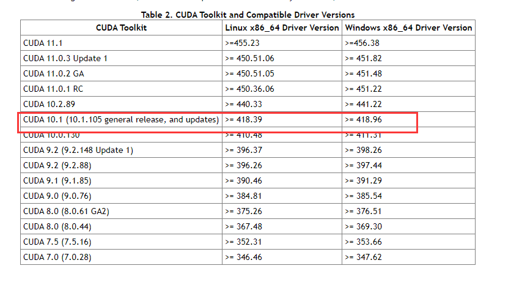
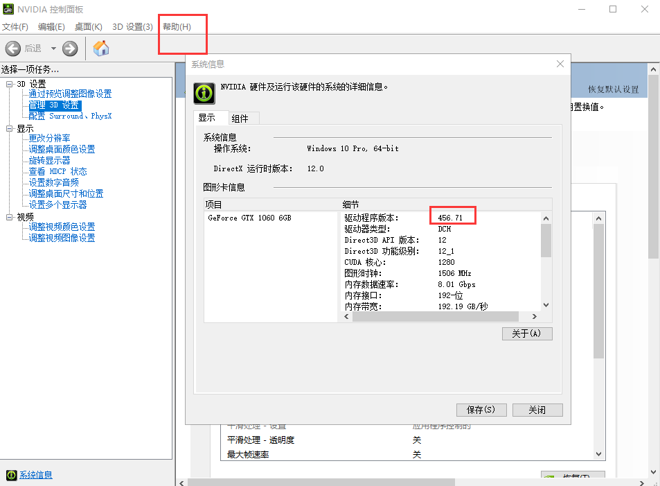
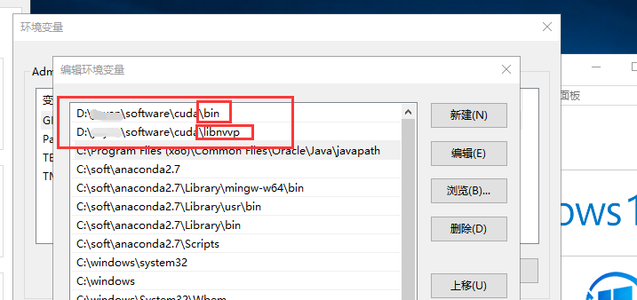
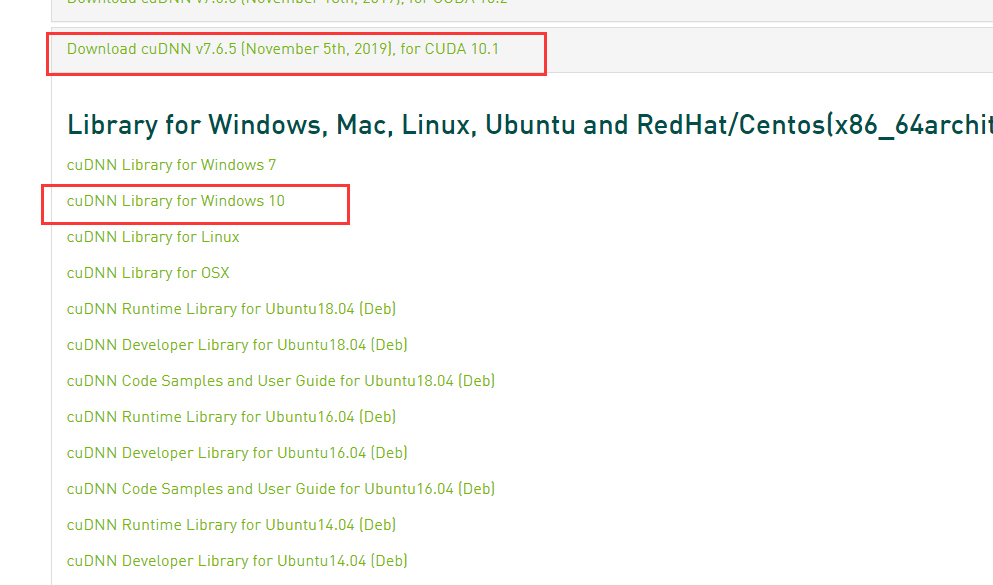

### Windows10环境下搭建CUDA10.1和pytorch1.6

#### 一. 安装CUDA10.1

> 这里需要安装鲁大师，查看自己电脑的显卡型号，这里是gtx 1060 ，6g

##### 1.1 安装Nvidia驱动

* 首先在Nvidia官网上安装显卡驱动，连接地址：https://www.nvidia.com/Download/index.aspx


* 这里需要去nVidia官网 https://docs.nvidia.com/cuda/cuda-toolkit-release-notes/index.html 查看cuda和显卡驱动对应表上cuda10.1对应驱动的版本号。



* 查看自己安装驱动的版本号：NVIDIA控制面板-帮助-系统信息中查看，这里可以看到我的驱动的版本号为456，这里是大于官网安装cuda10.1需要的418的驱动的。



##### 1.2 安装CUDA10.1

* 安装CUDA：适合哪个版本的CUDA，就可以去官网下载对应的CUDA了，但是官网首页的CUDA一般是最新版，我们可能需要下载旧版本比如CUDA10.1，可以cuu点击下面连接进行下载：https://developer.nvidia.com/cuda-toolkit-archiv，这里直接选择[CUDA Toolkit 10.1 ](https://developer.nvidia.com/cuda-10.1-download-archive-base)(Feb 2019)即可。这里一般选择自定义安装，可以通过命令行查看是否安装成功：`nvcc -V`，这里如果提升没有整个命令，说明还没有将cuda的路径添加到环境变量中，需要设置环境变量，添加CUDA安装目录下的`bin`和`libnvvp`目录，如下所示：



* 安装cuDNN：选择对应的版本号和系统，这里注意官网最前面的几个连接中都是windows10 的x86（32位）的，这里需要选择老一点的cuDNN的版本，如下所示



*  下载后，将压缩包解压得到cuda文件夹，文件夹下有三个文件夹，复制这三个文件夹到CUDA安装的目录'D:\soft\cuda'下，会自动将cudnn的三个文件夹的文件合并到其三个同名文件夹`bin`、`include`和`lib`中。

#### 二. 安装pytorch

> pytorch官网安装地址：https://pytorch.org/get-started/locally/

#### 2.1 修改pip源，提升下载包速度

如果本地pip下载很慢，修改pip源：Linux下，修改 ~/.pip/pip.conf (没有就创建一个文件夹及文件。文件夹要加“.”，表示是隐藏文件夹)

内容如下：

```
[global]
index-url = https://pypi.tuna.tsinghua.edu.cn/simple
[install]
trusted-host=mirrors.aliyun.com
```

windows下，直接在user目录中创建一个pip目录，如：C:\Users\xx\pip，新建文件pip.ini。内容同上。

##### 2.2 通过pip安装pytorch

pip安装：`pip install torch==1.6.0+cu101 torchvision==0.7.0+cu101 -f https://download.pytorch.org/whl/torch_stable.html`

##### 2.3 查看是否安装成功，并查看能否驱动cuda

```python
import torch
print(torch.cuda.is_available())
```

