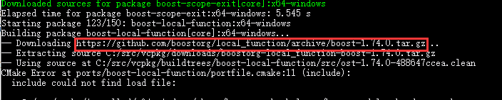

## C++的包管理工具——VCPKG

> 在我最初学C/C++的时候，一直为要下各种第三方库而烦恼，为啥C++没有像python一样简单的包管理工具呢？于是，它来了——VCPKG。

### 一. windows 下安装和配置

VCPKG的官方git地址：https://github.com/microsoft/vcpkg

#### 1.1 软件及平台要求

* windows7及其以上（本人的是Windows10）
* git
* VS2015及其以上（本人的是VS2019）

#### 1.2 windows下安装

* git克隆下官方的git仓库：`git clone https://github.com/microsoft/vcpkg`
* 进入到仓库中：`cd vcpkg`，注意下这里官方建议把vcpkg目录放到`C:\src\`下。
* 安装vcpkg：`boostrap-vcpkg.bat`

#### 1.3 安装库的示例

* 比如需要安装opencv，可以先搜索下vcpkg是否支持：`vcpkg.exe search opencv`
* 进行库的编译安装：`vcpkg.exe install opencv `
* 需要在visual studio中直接使用opencv：`vcpkg.exe integrate install`

### 二. 环境变量配置

这里需要注意两点：

* 把vcpkg的路径添加到环境变量中：`path = C:\src\vcpkg `，这样就可以随时随地使用`vcpkg.exe`咯，而不用每次到`C:\src\vcpkg`下执行命令。
* vcpkg默认是安装32位的库，我是需要安装x64的库，因此需要添加一个系统变量：`VCPKG_DEFAULT_TRIPLET=x64-windows`

### 三. VCPKG下载过慢解决方案

#### 3.1 先下载后编译

vcpkg直接执行命令`vcpkg.exe install opencv `的时候，会先下载需要的第三方包（下一个编译一个），那么有时候网速不好的时候，就会下不了，从而断掉，因此可以先把所有需要的库全部下载下来，再进行编译。

* 下载包，并编译：`vcpkg.exe install opencv --only-downloads`
* 对下载好的包继续编译：`vcpkg.exe install opencv`

#### 3.2 直接手动下载不好下载的包

在VCPKG下载包的时候，总是会碰到下载突然卡住，其中一个包下载不下来的情况，直接手动去下载(如下图框出的链接地址)下来，然后放在`C:\src\vcpkg\downloads `下面，重新再次执行下载命令即可。

