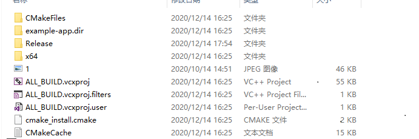
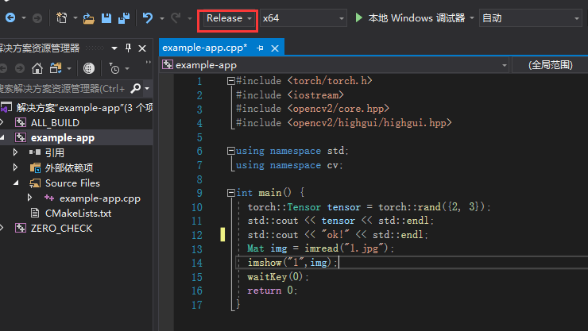

## windows 下搭建libtorch的C++环境搭建

> 参考文章：[NSTALLING C++ DISTRIBUTIONS OF PYTORCH](https://pytorch.org/cppdocs/installing.html)

### 一. 必要软件

* [vs2019](https://visualstudio.microsoft.com/zh-hans/vs/)：paddle和torch这里的编译都是由Visual Studio 2019完成的
* [libtorch](https://pytorch.org/get-started/locally/)：直接在官网上进行下载压缩包，这里说明下分为release和debug版本，直接下载release版本即可。
* [opencv](https://opencv.org/releases/)：windows下直接安装exe到本地即可。
* cmake：直接用scoop安装`scoop install cmake`

### 二. 安装libtorch环境

#### 2.1 构建一个C++项目

目录层级如下：

```
├─example-app
	 ├─build // 新建一个空目录
	 ├─CMakeLists.txt // 构建一个cmakelist
	 └─example-app.cpp // 构建一个cpp文件用于测试
```

其中，`CMakeList.txt`具体设置如下：

```cmake
cmake_minimum_required(VERSION 3.12 FATAL_ERROR)
project(example-app)

# add CMAKE_PREFIX_PATH
#增加opencv和libtorch的路径
list(APPEND CMAKE_PREFIX_PATH "D:/software/opencv/opencv/build/x64/vc15/lib") 
# 注意这里如果是vs2015的版本，需要改成 /build/x64/vc14/lib
list(APPEND CMAKE_PREFIX_PATH "D:/software/libtorch")


find_package(Torch REQUIRED)
find_package(OpenCV REQUIRED)

if(NOT Torch_FOUND)
    message(FATAL_ERROR "Pytorch Not Found!")
endif(NOT Torch_FOUND)

message(STATUS "Pytorch status:")
message(STATUS "    libraries: ${TORCH_LIBRARIES}")

message(STATUS "OpenCV library status:")
message(STATUS "    version: ${OpenCV_VERSION}")
message(STATUS "    libraries: ${OpenCV_LIBS}")
message(STATUS "    include path: ${OpenCV_INCLUDE_DIRS}")


add_executable(example-app example-app.cpp)
target_link_libraries(example-app ${TORCH_LIBRARIES} ${OpenCV_LIBS})
set_property(TARGET example-app PROPERTY CXX_STANDARD 11)
```

C++测试代码（`example-app.cpp`）如下（测试opencv和libtorch）：

```C++
#include <torch/torch.h>
#include <iostream>
#include <opencv2/core.hpp>
#include <opencv2/highgui/highgui.hpp>

using namespace std;
using namespace cv;

int main() {
  torch::Tensor tensor = torch::rand({2, 3});
  std::cout << tensor << std::endl;
  std::cout << "ok!" << std::endl;
  Mat img = imread("1.jpg");
  imshow("1",img);
  waitKey(0);
  return 0;
}
```

#### 2.2 编译和生成项目

* 进入到`build`目录：`cd build`
* 利用cmake进行编译： `cmake ..`
* 编译顺利的话，就可以看到`build`目录下生成了如下所示：



* 利用vs2019打开项目`example-app.vcxproj`
* 点击`example-app` 右键选择`设为启动项`，并且将版本选择`release`版本，点击`本地Windows调试器`



#### 2.3 调试问题的解决

* 报错信息：`由于找不到c10.dll`，`torch.dll`这种找不到dll文件的，直接将dll文件(这些dll文件都在`libtorch/lib`路径下)复制到`build/release`文件夹下
* `opencv_world3411.dll`和`opencv_ffmpeg3411_64.dll`等都在opencv的`opencv\opencv\build\x64\vc15\lib`路径下。
* 这里注意测试opencv的时候，需要将图片放置到和`example-app.vcxproj`同级目录下

#### 2.4 exe生成文件的平台移植

* 如果需要将生成的exe文件移植到其他PC上面，只需要将release文件夹下所有文件（包括dll文件和exe文件）复制到其他PC即可。
* 生成的exe文件在找图片的时候也是同级目录下找，因此需要将图片放置到`exe`文件的同级目录下。


