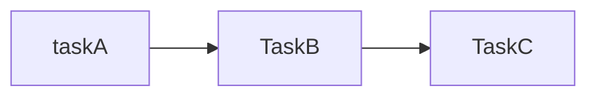
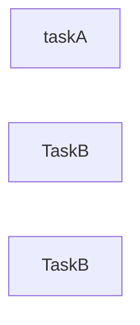
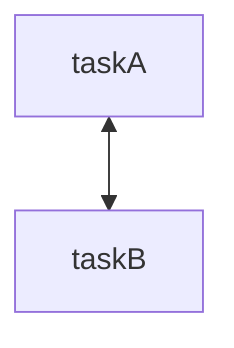
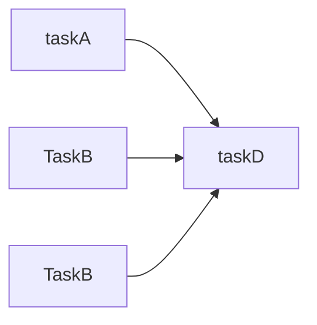

TaskFlow是OpenStack开源的Python库，他的优势：

* 可伸缩
* 简单创建任务级对象
* 任务可插拔
* 支持回滚容错机制

api的文档参考：https://docs.openstack.org/taskflow/ocata/

### 一. 定义完整的工作流

一个完整的taskflow包含了一下几个环节：

* 创建task
* 声明flow
* 构建engine

#### 1.1 构建task

构建task的方式是继承task类，然后修改其excute方法，这里可以指定任务的返回结果为res，注意还可以改写revert函数来重定义回滚的操作。

```python
from taskflow import task
class TaskA(task.Task):
  	default_provides = 'res'  
    
    def execute(self, a:int):
      res = a * a
      return res
    
    def revert(self, a):
      print("a执行失败。。。")
```

#### 1.2 构建flow

在构建完task之后，则是需要定义flow，一般的线性flow的定义如下：

```python
from taskflow.patterns import linear_flow as lf

flow = lf.Flow('main').add(
        Task1(),
    )
```

#### 1.3 定义engine

需要定义一个engine来运行整个工作流，用于task的执行、停止、继续和恢复。

```python
from taskflow import engines

engine = engines.load(flow)
engine.run()

# 拿到所有的结果
context = engine.storage.fetch_all()
```

### 二. 工作流形式

taskflow的工作流组合形式分为3种：

* 串行工作流
* 并行工作流
* 图流

#### 2.1 串行工作流——linear_flow
顾名思义，就是多个工作流利用串行的方式将多个flow拼接在一起，然后依次顺序执行，每个flow依赖于他的前一个的flow。



注意：这里在构建串行的工作流后，我们可以选择engine时候，选择`engine='serial'`

```python
from taskflow.patterns import linear_flow as lf
from taskflow import engines

class TaskA(task.Task):

    def execute(self):
        print('task A')

class TaskB(task.Task):
    def execute(self):
        print('task B')

flow = lf.Flow('merge_ab').add(
  			TaskA(),
  			TaskB())
engine = engines.load(flow, engine='serial')
```


#### 2.2 并行工作流——unordered_flow

多个工作流可以被指定为并行执行，python里面的多线程一样，谁先抢到资源谁就先执行，等到三个都执行完毕了，这个流就结束了。



注意：这里在构建并行的工作流后，我们可以选择engine时候，选择`engine='parallel'`

```python
from taskflow.patterns import unordered_flow as uf
from taskflow import engines

class TaskA(task.Task):

    def execute(self):
        print('task A')

class TaskB(task.Task):
    def execute(self):
        print('task B')

flow = uf.Flow('merge_ab').add(
  			TaskA(),
  			TaskB())
engine = engines.load(flow, engine='parallel')
```

#### 2.3 图流——graph_flow

对于两两有相关关联的工作流，比如图结构中的两个节点，两个节点之间有一条边（这里指代两节点有依赖关系），即taskA执行的时候需要taskB，而taskB执行的时候依赖了taskA。一般来说这种方式用的最少。



```python
from taskflow import task
from taskflow.patterns import graph_flow as gf
from taskflow import engines


class TaskA(task.Task):
    def execute(self):
        print("TaskA executed")


class TaskB(task.Task):
    def requires(self):
        return ['data_a']

    def execute(self, data_a):
        print("TaskB executed")


def build_flow():
    flow = gf.Flow('demo_flow')

    # 获取节点对象
    a_node = flow.add(TaskA())
    b_node = flow.add(TaskB())

    # 节点间建立依赖
    a_node.precede(b_node)  # 正确调用层级

    return flow


engines.run(build_flow())
```

### 三. 完整的项目的例子

#### 3.1 串行和并行工作流混合

对于需要构建多个并行工作流得到多个各自的结果后，然后需要构建一个基于三者结果合并计算的工作流，那么这里可以构建串行和并行的混合工作流，如下所示



那么对于上述串并行混合的工作流而言，可以参考下面代码，其中包含了项目中可能用到的：

* 多线程并行运行
* 多flow组合形式
* 每个task结合了输入和输出

```python
from taskflow import task
from taskflow.patterns import unordered_flow as uf
from taskflow.patterns import linear_flow as lf
from taskflow import engines
from concurrent.futures.thread import ThreadPoolExecutor

pool_executor = ThreadPoolExecutor(max_workers=3)


# 定义并行任务类，继承 task.Task 并声明 provides
class TaskA(task.Task):

    def execute(self, a:int):
        res_a = a * a
        print(f'task a result:{res_a}')
        return res_a

class TaskB(task.Task):

    def execute(self, b:int):
        res_b = b * b
        print(f'task b result:{res_b}')
        return res_b

class TaskC(task.Task):

    def execute(self, c: int):
        res_c = c + 2
        print(f'task c result:{res_c}')
        return res_c

class FinalTask(task.Task):

    def execute(self, res_a, res_b, res_c):
        final_res = res_a + res_b + res_c
        print(f'task final result:{final_res}')
        return final_res

# 创建主流程
def build_flow():
    parallel_flow = uf.Flow('parallel_tasks').add(
     TaskA(name='taska',
                    provides='res_a'),
            TaskB(name='taskb',
              provides='res_b'),
            TaskC(name='taskc',
              provides='res_c'),
    )
    main_flow = lf.Flow('main').add(
        parallel_flow,
        FinalTask(name='final',
                  provides='final_res'),
    )
    return main_flow

if __name__ == "__main__":
    store = {
        'a':1, 'b':2, 'c':3
    }
    flow = build_flow()
    eng = engines.load(flow, store=store, engine='parallel', executor=pool_executor)
    eng.run()

    context = eng.storage.fetch_all()
    result = context.get('final_res')
    a_res = context.get('res_a')
    print(f'task A res: {a_res}, final_res: {result}')
```

### 
